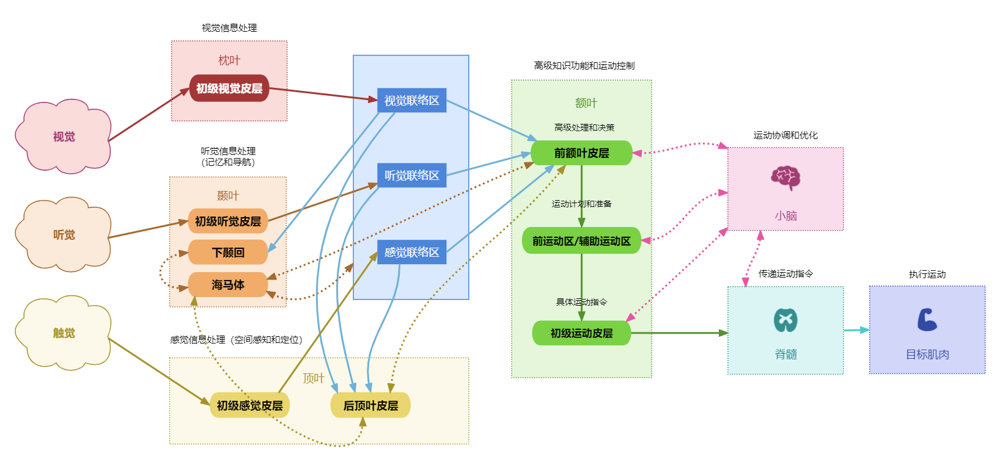

# BrainBotX 项目

## 项目简介


**BrainBotX** 是一个基于人工智能（AI）和机器人流程自动化（RPA）的智能系统，旨在模拟人脑的工作机制，创建类似于人脑的多模态感知、智能决策、灵活执行和自我学习的能力。该项目的命名灵感来自大脑中的神经网络和执行过程，结合了强大的自动化能力。

### 项目的主要特性包括：

- **多模态感知**：支持处理视觉、听觉、文本和环境等多种输入。
- **情境感知与上下文理解**：系统能结合环境信息和上下文来进行智能决策。
- **实时双向反馈**：执行层与决策层之间实现实时通信，根据反馈动态调整策略。
- **记忆与学习**：引入短期记忆（Redis）和长期记忆（MySQL），通过强化学习模型自我优化。
- **并行处理与协同**：通过异步编程和多进程处理，提高系统的处理效率。
- **模块化架构**：分为感知层、决策层、执行层和反馈层，职责明确，各层模块协同工作。
- **配置管理和监控**：使用 `.env` 文件进行配置管理，引入 Prometheus 和 Grafana 进行系统监控和数据可视化。

## 项目结构

- **perception_service**：感知层，负责处理多模态输入并进行数据融合。
- **decision_service**：决策层，结合记忆和强化学习模型，做出智能决策。
- **execution_service**：执行层，执行决策并实时反馈执行结果。
- **feedback_service**：反馈层，分析长期记忆，优化模型和规则。
- **shared_common**：跨微服务的通用模块，包含神经元类和配置文件等。
- **monitoring**：监控配置，包含 Prometheus 和 Grafana 的设置。
- **redis**：Redis 的配置文件。

## 快速开始

### 前置条件

- 安装 Docker 和 Docker Compose
- 获取 OpenAI API 密钥（用于调用 GPT 模型）

### 步骤

1. **克隆项目**

   ```bash
   git clone https://your_repository_url/BrainBotX.git
   cd BrainBotX
   ```

2. **配置环境变量**

   在项目根目录下创建 `.env` 文件，填入必要的配置（参考 `.env` 文件内容）。

3. **启动服务**

   ```bash
   docker-compose up --build
   ```

   该命令将构建并启动所有服务，包括 Kafka、MySQL、Redis、Prometheus 和 Grafana。

4. **访问服务**

   - 感知服务（Perception Service）：`http://localhost:8001`
   - 决策服务（Decision Service）：`http://localhost:8002`
   - 执行服务（Execution Service）：`http://localhost:8003`
   - 反馈服务（Feedback Service）：`http://localhost:8004`
   - Grafana（监控）：`http://localhost:3000`
   - Prometheus（监控）：`http://localhost:9090`

## 目录说明

### 1. 感知服务（perception_service）

负责处理多模态输入，包括：

- **visual_perception.py**：统一的视觉感知模块，处理静态图像和视频输入，支持多帧处理与特征提取。
- **auditory_perception.py**：听觉感知模块，处理音频输入。
- **text_perception.py**：文本感知模块，处理文本输入。
- **environment_perception.py**：环境感知模块，获取环境和上下文信息。
- **data_fusion.py**：数据融合模块，将视觉、听觉、文本和环境等多模态数据进行整合，提供给决策层进行分析。

### 2. 决策服务（decision_service）

负责智能决策，包括：

- **central_coordinator.py**：中央协调器，整合记忆和强化学习，处理实时反馈。
- **memory_module.py**：记忆模块，管理短期和长期记忆，以及上下文信息。
- **reinforcement_learning.py**：强化学习代理，结合当前状态和历史经验，做出决策。
- **rule_optimizer.py**：规则优化模块，根据反馈调整规则。

### 3. 执行服务（execution_service）

负责执行决策并反馈执行结果，包括：

- **action_executor.py**：动作执行器，接收决策并执行任务。
- **task_manager.py**：任务管理器，调度和管理具体任务。
- **real_time_feedback.py**：实时反馈模块，发送执行结果到决策层。
- **rpa_executor.py**：RPA 执行器，执行自动化任务。
- **api_caller.py**：API 调用器，调用外部 API。

### 4. 反馈服务（feedback_service）

负责分析长期记忆，优化模型和规则，包括：

- **learning_optimizer.py**：学习优化器，使用长期记忆更新强化学习模型。

### 5. 公共模块（shared_common）

跨微服务的通用模块，包含神经元类和配置文件等。

- **common_config.py**：共享的配置文件，定义了多个微服务的公共配置参数
- **base_neuron.py**: 神经元基类，所有具体神经元的基础类
- **perception_neuron.py**: 感知神经元，用于处理感知层输入的原始数据，提取关键信息并将其传递给决策层
- **decision_neuron.py**: 决策神经元，负责接收来自感知神经元的数据，并根据系统的历史经验、上下文信息及规则优化器做出决策
- **execution_neuron.py**: 执行神经元，负责将决策神经元的决策输出转化为具体的执行指令，并与执行服务交互，确保指令的正确执行
- **feedback_neuron.py**: 反馈神经元，负责接收来自执行层的反馈数据，并将其传递给决策层或感知层以调整系统行为


### 6. 监控配置（monitoring）

- **prometheus.yml**：Prometheus 配置文件。
- **grafana/**：Grafana 配置和仪表盘。

## 主要技术栈

- **编程语言**：Python 3.9
- **Web 框架**：FastAPI
- **消息队列**：Kafka
- **数据库**：MySQL、Redis
- **机器学习**：PyTorch
- **容器化**：Docker、Docker Compose
- **配置管理**：pydantic、dotenv
- **日志和监控**：logging、Prometheus、Grafana

## 注意事项

- **安全性**：请妥善保管 `.env` 文件中的敏感信息，避免泄露。
- **资源占用**：由于涉及多种服务，启动时可能需要较高的系统资源。
- **模型训练**：强化学习模型的训练需要一定的时间和数据量，初始时可能需要调整参数。

## 贡献指南

欢迎对 **BrainBotX** 项目提出建议和改进。如有任何问题或想法，请提交 issue 或 pull request。

## 许可证

该项目采用 MIT 许可证。
